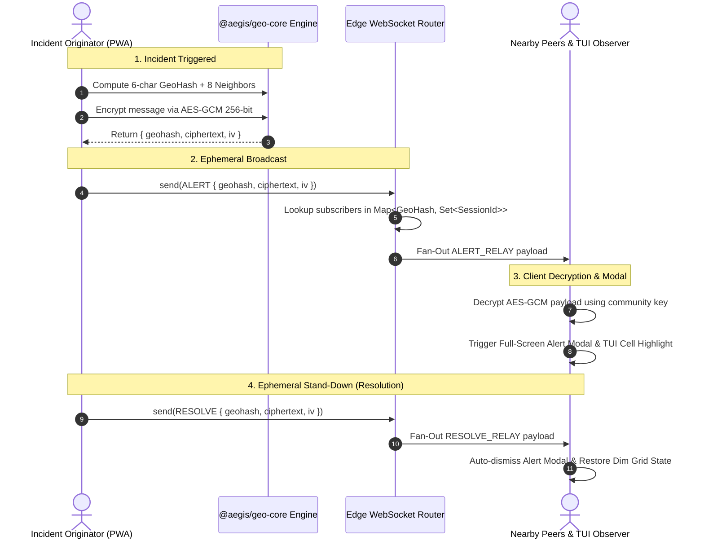

<div align="center">

# 🛡️ AEGIS

### Privacy-Preserving Geospatial Incident Swarm

**Instantly alert your neighbors within a 500-meter radius of a micro-emergency — with zero central database tracking or live GPS storage.**

[](https://github.com/Destroyer795/aegis/actions)


</div>

---

## 🏆 Why Aegis?

During neighborhood micro-emergencies — gas leaks, severe hazards, lost children, or active threats — fast localized communication saves lives. However, existing safety apps force users to trade away their location privacy to centralized servers.

| Platform | Sub-second Speed | Zero GPS Tracking | End-to-End Encryption | Peer-to-Peer Handoff |
|----------|:----------------:|:-----------------:|:---------------------:|:-------------------:|
| **Nextdoor / Citizen** | ✅ | ❌ Centralized GPS database | ❌ Server reads all messages | ❌ Centralized servers |
| **WhatsApp / Telegram** | ❌ Manual groups | ❌ Group admin setup needed | ✅ E2E encrypted | ❌ Centralized servers |
| **Emergency Services (911)** | ✅ Dispatch delay | ❌ Full tracking | ❌ Unencrypted voice/SMS | ❌ No neighbor swarm |
| **🛡️ AEGIS** | **✅ Real-time (<50ms)** | **✅ Mathematically zero** | **✅ AES-GCM 256-bit** | **✅ WebRTC P2P Data** |

**Aegis is architected around absolute zero-knowledge privacy.** The edge server acts only as an anonymous routing hub. It never receives raw GPS coordinates, never stores user identities, and holds all routing state purely in volatile memory.

---

## 🧠 System Architecture & Data Flow

```
┌─────────────────────────────────────────────────────────────────────────────────────────┐
│                                   CLIENT DEVICE (PWA)                                   │
│                                                                                         │
│  ┌───────────────────┐       ┌─────────────────────────┐       ┌─────────────────────┐  │
│  │   GPS Geolocation │       │     @aegis/geo-core     │       │ Client Crypto Engine│  │
│  │   watchPosition() │──────▶│   GeoHash 6-Char Cell   │──────▶│ AES-GCM 256-bit    │  │
│  │   (Raw Lat/Lng)   │       │   Compute 8 Neighbors   │       │ PBKDF2 Derivation   │  │
│  └───────────────────┘       └─────────────────────────┘       └─────────────────────┘  │
│            │                              │                               │             │
│            ▼                              ▼                               ▼             │
│   🔒 Raw Lat/Lng NEVER          Opaque GeoHash Keys             Ciphertext + IV         │
│      leaves the device         ["9q8yyk", "9q8yym"...]          Hex Strings Only        │
│                                           │                               │             │
└───────────────────────────────────────────┼───────────────────────────────┼─────────────┘
                                            │                               │
                                            └──────────────┬────────────────┘
                                                           │
                                                           │ WebSocket (wss://)
                                                           │ JSON Payload: { type: 'ALERT', geohash, ciphertext, iv }
                                                           ▼
┌─────────────────────────────────────────────────────────────────────────────────────────┐
│                            EDGE WEBSOCKET ROUTER (Zero-Tracking)                        │
│                                                                                         │
│    In-Memory Pub/Sub Engine: Map<GeoHashString, Set<SessionId>>                         │
│                                                                                         │
│    • GeoHash "9q8yyk" ──▶ [ Session_Alpha, Session_Beta ]                              │
│    • GeoHash "9q8yym" ──▶ [ Session_Gamma, Session_Delta ]                             │
│                                                                                         │
│    ⚡ ZERO Databases. ZERO File Systems. ZERO Tracking Logs.                           │
│    Routes opaque ciphertext strings strictly by GeoHash match.                          │
└──────────────────────────────────────────────┬──────────────────────────────────────────┘
                                               │
                                               │ ALERT_RELAY / RESOLVE_RELAY Fan-Out
                                               ▼
┌─────────────────────────────────────────────────────────────────────────────────────────┐
│                             NEIGHBORHOOD SWARM CONSUMERS                                │
│                                                                                         │
│  ┌────────────────────────────────────────┐     ┌────────────────────────────────────┐  │
│  │           React Mobile PWA             │     │      Python TUI Observer           │  │
│  │  • Decrypts AES-GCM payload in browser │     │  • Monitors 3x3 neighborhood grid  │  │
│  │  • Triggers reactive emergency modal   │     │  • Real-time reactive cell flash   │  │
│  │  • Ephemeral Stand-Down resolution     │     │  • Audit logging of network log    │  │
│  └────────────────────────────────────────┘     └────────────────────────────────────┘  │
│                      │                                                                  │
│                      └─────────────────── WebRTC Signaling ─────────────────────────────┘
│                                           (Direct P2P Peer Data Channel)                │
└─────────────────────────────────────────────────────────────────────────────────────────┘
```

---

## 🔐 Cryptographic & Geospatial Specification

### 1. Geospatial Logic (`@aegis/geo-core`)
* **Precision Level:** 6-character GeoHash encoding (~1.22 km × 0.61 km cell bounding box).
* **Coverage Guarantee:** To eliminate boundary blind spots, every client calculates its central GeoHash cell plus all **8 cardinal & intercardinal surrounding neighbor cells** (N, NE, E, SE, S, SW, W, NW), creating a continuous ~500m incident detection envelope.
* **Edge Case Engineering:** Full mathematical handling for Date Line wrapping ($\pm180^\circ$ longitude) and polar latitude clamping ($-90^\circ$ to $+90^\circ$).

### 2. Zero-Knowledge Encryption (`AES-GCM-256`)
* **Key Derivation:** Client passphrases (e.g., agreed community/neighborhood room secrets) are transformed into a 256-bit cryptographic key using **PBKDF2 with SHA-256** across **100,000 iterations**.
* **Authenticated Encryption:** Payload messages are encrypted via **AES-GCM**. A unique random **96-bit Initialization Vector (IV)** is generated via `crypto.getRandomValues()` for every single broadcast.
* **Opaque Transport:** Both `ciphertext` and `iv` are serialized as hex strings. The Edge Router cannot read, parse, or alter alert contents.



---

## 🛠️ Monorepo Package Matrix

The repository is structured as an integrated monorepo linked via Node workspaces (`file:` links):

```
aegis/
├── geo-core/         # Shared mathematical & cryptographic library (TypeScript)
├── edge-router/      # In-memory WebSocket Pub/Sub server (Node.js/TypeScript)
├── web-app/          # Mobile-first Emergency Beacon PWA (React 18 / Vite)
└── tui-observer/     # Terminal Observability Dashboard (Python Textual)
```

### Package Capabilities

| Package | Directory | Tech Stack | Responsibility |
|---------|-----------|------------|----------------|
| `@aegis/geo-core` | `/geo-core` | TypeScript, WebCrypto, Vitest | GeoHash math, neighbor stepping, WebCrypto AES-GCM, shared payload types |
| `@aegis/edge-router` | `/edge-router` | Node.js, `ws`, TypeScript, Vitest | Serverless-ready WebSocket router, in-memory Session/GeoHash maps, WebRTC signaling relay |
| `@aegis/web-app` | `/web-app` | React 18, Vite, Lucide-React, CSS | Mobile beacon, live GPS watcher, mock geofence simulator, emergency alert & resolve UI |
| `@aegis/tui-observer` | `/tui-observer` | Python 3.11, Textual, Rich | Cyberpunk dashboard, 3x3 visual geogrid watcher, real-time alert reactive flashing |

---

## 🚀 Quick Start Guide

### Prerequisites
* **Node.js**: `v20.x` or `v22.x`
* **Python**: `v3.11+`
* **npm**: `v10.x+`

### 1. Build Shared Core Library
```bash
cd geo-core
npm install
npm run build     # Compiles TypeScript declarations to dist/
npm test          # Runs 27 geo-core unit tests (14 geohash + 13 crypto)
```

### 2. Start the Edge WebSocket Router
In a new terminal window:
```bash
cd edge-router
npm install
npm run dev       # Starts WebSocket router on ws://localhost:8080
```

### 3. Launch the Mobile Web Application (PWA)
In a new terminal window:
```bash
cd web-app
npm install
npm run dev       # Launches Vite dev server on http://localhost:3000
```

### 4. Launch the Python TUI Observability Monitor
In a new terminal window:
```bash
cd tui-observer
python -m venv .venv
# On Windows PowerShell:
.\.venv\Scripts\Activate.ps1
# On Linux/macOS:
source .venv/bin/activate

pip install -r requirements.txt
python src/main.py
```

---

## 🧪 Comprehensive Test Suite

The Aegis monorepo includes extensive automated unit and integration test coverage verifying cryptographic isolation and geospatial precision.

```bash
# Run all geo-core tests
cd geo-core && npm test

# Run all edge-router integration tests
cd edge-router && npm test
```

### Verification Matrix (31/31 Passing Tests)
* ✅ **GeoHash Encoding & Decoding:** Tests precise coordinate conversions across equator, prime meridian, and date line.
* ✅ **8-Neighbor Grid Computation:** Verifies cardinal/intercardinal cell calculation and pole clamping.
* ✅ **AES-GCM Encryption & Decryption:** Tests 256-bit roundtrips, random IV generation, Unicode/Emoji payload handling, and 280-character max limits.
* ✅ **Tamper & Key Rejection:** Verifies authentication tag failures on tampered ciphertext or invalid community keys.
* ✅ **Pub/Sub Fan-Out:** Tests multi-client WebSocket subscriptions, isolated room routing, and session cleanup on disconnect.

---

## 🛡️ Threat Model & Security Posture

| Threat Vector | Mitigation | Technical Verification |
|---------------|------------|------------------------|
| **Server Location Tracking** | Server only receives 6-character GeoHash strings | Server code has no database imports or logging hooks. |
| **Eavesdropping on Edge Transit** | TLS/WSS transport encryption | All production WebSocket streams enforce WSS protocol. |
| **Payload Interception** | Client-side AES-GCM 256-bit encryption | Edge Router only sees hex ciphertext strings. |
| **Replay & Modification Attacks** | AES-GCM authentication tags + unique 96-bit random IVs | Modifying 1 bit of ciphertext causes decryption rejection. |
| **State Subpoenas** | Volatile in-memory state architecture | Router state is held in JavaScript `Map` objects; rebooting destroys all data. |

---

## 📄 License

Distributed under the **MIT License**. See `LICENSE` for details.

---

<div align="center">

**Built for developers and privacy advocates who believe emergency safety should never come at the expense of human tracking.**

*Aegis doesn't protect your data from leaks — it ensures your location data is never collected in the first place.*

</div>
